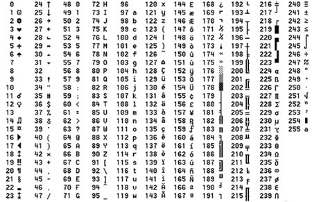

### Instituto de Computação - Unicamp
### MC999 - Introdução à Computação

Laboratório !ID! - !TITLE!
=====================================

Prazo de entrega: __!DEADLINE!__

Peso: 1

*Professor:* José da Silva  
*Monitor:* Maria da Silva

---------------------------------------------------------
Descrição
---------

Escreva um programa que conta o número de caracteres e o número de linhas da entrada.



Entrada
-------

A entrada é um texto qualquer em ASCII

### Exemplo

```
    2 3 4 5 6 7       30 40 50 60 70 80 90 100 110 120
  -------------      ---------------------------------
 0:   0 @ P ` p     0:    (  2  <  F  P  Z  d   n   x
 1: ! 1 A Q a q     1:    )  3  =  G  Q  [  e   o   y
 2: " 2 B R b r     2:    *  4  >  H  R  \  f   p   z
 3: # 3 C S c s     3: !  +  5  ?  I  S  ]  g   q   {
 4: $ 4 D T d t     4: "  ,  6  @  J  T  ^  h   r   |
 5: % 5 E U e u     5: #  -  7  A  K  U  _  i   s   }
 6: & 6 F V f v     6: $  .  8  B  L  V  `  j   t   ~
 7: ´ 7 G W g w     7: %  /  9  C  M  W  a  k   u  DEL
 8: ( 8 H X h x     8: &  0  :  D  N  X  b  l   v
 9: ) 9 I Y i y     9: ´  1  ;  E  O  Y  c  m   w
 A: * : J Z j z
 B: + ; K [ k {
 C: , < L \ l |
 D: - = M ] m }
 E: . > N ^ n ~
 F: / ? O _ o DEL
```

  Coluna 1   |  Coluna 2   |  Coluna 3   |  Coluna 4
------------ | ----------- | ----------- | ------------
 |  |  | 


### Caracteres especiais só no enunciado

```
① ② ③ ④ ⑤ ⑥ ⑦ ⑧ ⑨ ⑩
♈ ♉ ♊ ♋ ♌ ♍ ♎ ♏ ♐ ♑ ♒ ♓
𝕬 𝕭 𝕮 𝕯 𝕰 𝕱 𝕲 𝕳 𝕴 𝕵 𝕶 𝕷 𝕸 𝕹 𝕺 𝕻 𝕼 𝕽 𝕾 𝕿
僀 僁 僂 僃 僄 僅 僆 僇 僈 僉 僊 僋 僌 働 僎 像 僐 僑 僒 僓 僔
```

Saída
-----

A saída é a quantidade de caracteres e linhas devidamente alinhadas.

### Exemplo:

```
Caracteres: 25092
Linhas:     749
```

Execução do Programa
--------------------

O programa deve ler a entrada até o final (**EOF**) e imprimir o resultado com uma quebra de linha (\n) ao final da execução.

Exemplos
--------

!TESTE!1!
!TESTE!2!

###### Exemplo sem teste

* Entrada

    ```
123
    ```

* Saída

    ```
Caracteres: 3
Linhas:     1
    ```

Para mais exemplos, consulte os [testes abertos no Susy](dados/testes.html).

Observações
-----------
* O número máximo de submissões é **!MAX_SUBMISSIONS!**;
* O seu programa deve estar completamente contido em um único arquivo denominado `!BASENAME!.c` ou `!BASENAME!.py`;
* Para a realização dos testes do SuSy, a compilação se dará da seguinte forma:  
  `gcc -std=c99 -pedantic -Wall -o !BASENAME! !BASENAME!.c`;
* Você deve incluir, no início do seu programa, uma breve descrição dos objetivos do programa, da entrada e da saída, além do seu nome e do seu RA;
* Indente corretamente o seu código e inclua comentários no decorrer do seu programa.

Critérios importantes
---------------------

Independentemente dos resultados dos testes do SuSy, o não cumprimento dos critérios abaixo implicará em nota zero nesta tarefa de laboratório.

* O único header aceito para essa tarefa é o `stdio.h`.

Dica
----

Leia o seguinte código, ele pode te auxiliar:

```C
include("solution/C/lab00_main.c")
```
